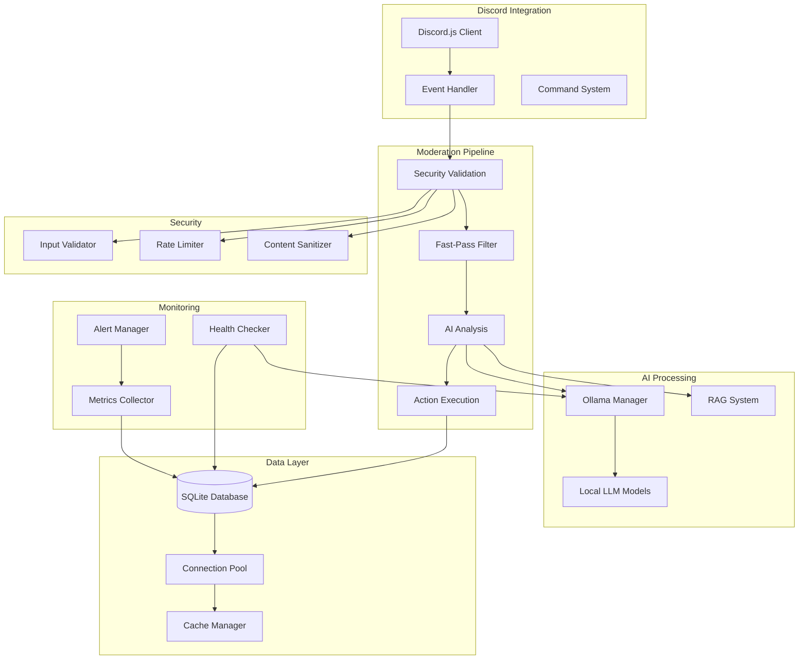

# 🛡️ Greatshield Discord Moderation Bot

[](https://github.com/greatshield/greatshield-bot/actions/workflows/ci-cd.yml)
[](https://codecov.io/gh/greatshield/greatshield-bot)
[](https://opensource.org/licenses/MIT)
[](https://discord.gg/greatshield)

> **AI-powered Discord moderation bot with local-first architecture, built for privacy, performance, and customization.**

## ✨ Features

### 🤖 **AI-Powered Moderation**
- **Local LLM Integration** with Ollama - no data leaves your server
- **Multi-model support** - Llama2, Mistral, CodeLlama, Neural Chat
- **Contextual understanding** - analyzes message context and intent
- **Real-time processing** with sub-second response times

### 🔒 **Advanced Security**
- **Input validation** and sanitization against malicious content
- **Rate limiting** with burst protection and escalating penalties
- **Content filtering** for XSS, SQL injection, and dangerous patterns
- **Privacy-first** - all AI processing happens locally

### 📊 **Comprehensive Monitoring**
- **Real-time dashboards** for moderation metrics
- **Health monitoring** for all system components
- **Performance analytics** and optimization recommendations
- **Alert system** with multiple notification channels

### ⚡ **High Performance**
- **Database optimization** with connection pooling and caching
- **Efficient processing** with fast-pass filtering
- **Scalable architecture** supporting large Discord servers
- **Resource optimization** for minimal system impact

### 🔧 **Enterprise-Ready**
- **Backup and recovery** with automated scheduling
- **Configuration management** with validation and hot-reloading
- **Structured logging** with multiple output formats
- **CI/CD pipeline** with automated testing and deployment

## 🚀 Quick Start

### Option 1: Download Executable (Recommended)

1. **Download** the latest release for your platform:
   - [Windows](https://github.com/greatshield/greatshield-bot/releases/latest/download/greatshield-win.exe)
   - [macOS](https://github.com/greatshield/greatshield-bot/releases/latest/download/greatshield-mac)
   - [Linux](https://github.com/greatshield/greatshield-bot/releases/latest/download/greatshield-linux)

2. **Run the setup wizard**:
   ```bash
   ./greatshield-win.exe setup
   ```

3. **Start the bot**:
   ```bash
   ./greatshield-win.exe
   ```

### Option 2: Docker Deployment

```bash
# Clone and configure
git clone https://github.com/greatshield/greatshield-bot.git
cd greatshield-bot
cp .env.example .env

# Edit .env with your Discord bot token and settings
# Start with Docker Compose
docker-compose up -d
```

### Option 3: From Source

```bash
# Prerequisites: Node.js 20+, npm
git clone https://github.com/greatshield/greatshield-bot.git
cd greatshield-bot

# Install and build
npm install
npm run build

# Start the bot
npm start
```

## 📋 Requirements

### System Requirements
- **Node.js** 20.0.0 or higher
- **RAM** 2GB minimum, 4GB+ recommended
- **Storage** 1GB free space
- **OS** Windows 10+, macOS 10.15+, Ubuntu 18.04+

### Dependencies
- **Discord Bot** with appropriate permissions
- **Ollama** for local AI processing
- **SQLite** (bundled with the application)

## 🎯 Core Components

### 🧠 AI Moderation Pipeline
```
Message → Security Validation → Fast-Pass Filter → AI Analysis → Action Execution
```

- **Security Layer**: Input validation, rate limiting, content sanitization
- **Fast-Pass Filter**: Rule-based filtering for known patterns
- **AI Analysis**: Context-aware content analysis with local LLMs
- **Action System**: Configurable responses (warn, timeout, ban, etc.)

### 📊 Monitoring & Analytics
- **System Health**: Real-time monitoring of all components
- **Performance Metrics**: Response times, throughput, resource usage
- **Moderation Statistics**: Action breakdowns, effectiveness tracking
- **Alert Management**: Configurable thresholds and notifications

### 🔐 Security Architecture
- **Multi-layer Protection**: Defense in depth approach
- **Zero Trust**: All inputs validated and sanitized
- **Privacy Focused**: No data sent to external services
- **Audit Trail**: Comprehensive logging for compliance

## 📖 Documentation

### 📚 **Setup & Configuration**
- [📋 Setup Guide](./docs/SETUP_GUIDE.md) - Complete installation and configuration
- [⚙️ Configuration Reference](./docs/CONFIG_REFERENCE.md) - All configuration options
- [🐳 Docker Deployment](./docs/DOCKER_GUIDE.md) - Container deployment guide

### 🔧 **Administration**
- [📊 Monitoring Guide](./docs/MONITORING_GUIDE.md) - System monitoring and alerts
- [💾 Backup & Recovery](./docs/BACKUP_GUIDE.md) - Data protection strategies
- [🔐 Security Best Practices](./docs/SECURITY_GUIDE.md) - Hardening and security

### 🎨 **Customization**
- [📜 Policy Management](./docs/POLICY_GUIDE.md) - Creating and managing moderation policies
- [🔌 API Documentation](./docs/API_GUIDE.md) - Integration and automation
- [🎛️ Advanced Configuration](./docs/ADVANCED_CONFIG.md) - Fine-tuning and optimization

### 🛠️ **Development**
- [🏗️ Contributing Guide](./CONTRIBUTING.md) - How to contribute to the project
- [🧪 Testing Guide](./docs/TESTING_GUIDE.md) - Running and writing tests
- [📋 Changelog](./CHANGELOG.md) - Version history and updates

## 🏗️ Architecture



## 🔥 Performance

### Benchmarks
- **Message Processing**: < 100ms average response time
- **Throughput**: 1000+ messages/minute sustained
- **Memory Usage**: < 256MB base, < 512MB under load
- **Database Operations**: < 10ms average query time
- **AI Analysis**: < 500ms for complex content

### Optimizations
- **Connection Pooling**: Efficient database connections
- **Smart Caching**: Reduced redundant AI calls
- **Fast-Pass Filtering**: Skip AI for obvious cases
- **Background Processing**: Non-blocking operations
- **Resource Management**: Automatic cleanup and optimization

## 🛡️ Security

### Security Features
- **Input Validation**: Comprehensive sanitization
- **Rate Limiting**: Protection against abuse
- **SQL Injection Protection**: Parameterized queries
- **XSS Prevention**: Content sanitization
- **Access Control**: Role-based permissions

### Privacy & Compliance
- **Local Processing**: No external AI services
- **Data Minimization**: Store only necessary data
- **Audit Logging**: Complete action trail
- **GDPR Ready**: User data management features
- **Configurable Retention**: Automatic data cleanup

## 🤝 Contributing

We welcome contributions! Please see our [Contributing Guide](./CONTRIBUTING.md) for details.

### Development Setup
```bash
# Clone the repository
git clone https://github.com/greatshield/greatshield-bot.git
cd greatshield-bot

# Install dependencies
npm install

# Run tests
npm test

# Start development server
npm run dev
```

### Code Quality
- **TypeScript** for type safety
- **ESLint** and **Prettier** for code formatting
- **Jest** for comprehensive testing
- **Husky** for pre-commit hooks
- **Automated CI/CD** with GitHub Actions

## 🗺️ Roadmap

### 🎯 **Current Focus (v1.x)**
- [x] Core moderation pipeline
- [x] Local AI integration
- [x] Security hardening
- [x] Performance optimization
- [x] Monitoring and alerting
- [x] Backup and recovery
- [ ] Advanced policy management
- [ ] Multi-language support

### 🚀 **Future Plans (v2.x)**
- [ ] Plugin architecture
- [ ] Advanced ML models
- [ ] Cluster deployment
- [ ] GraphQL API
- [ ] Mobile management app
- [ ] Advanced analytics
- [ ] Integration marketplace

### 🎨 **Long-term Vision (v3.x)**
- [ ] Multi-platform support (Telegram, Slack)
- [ ] Federated moderation network
- [ ] Advanced AI training
- [ ] Enterprise management suite

## 📊 Stats


## 📞 Support

### Community Support
- **Discord Server**: [Join our community](https://discord.gg/greatshield)
- **GitHub Issues**: [Report bugs or request features](https://github.com/greatshield/greatshield-bot/issues)
- **Discussions**: [Community Q&A](https://github.com/greatshield/greatshield-bot/discussions)

### Enterprise Support
- **Priority Support**: 24/7 assistance for critical issues
- **Custom Development**: Tailored features and integrations
- **Training & Consultation**: Best practices and optimization
- **SLA Guarantees**: Uptime and response time commitments

[Contact Sales →](mailto:enterprise@greatshield.bot)

## 📄 License

This project is licensed under the MIT License - see the [LICENSE](./LICENSE) file for details.

## 🙏 Acknowledgments

- **Ollama Team** - For the excellent local LLM platform
- **Discord.js** - For the robust Discord API library
- **Contributors** - Everyone who has contributed to this project
- **Community** - For feedback, testing, and feature requests

---

<div align="center">

**[🌟 Star this repository](https://github.com/greatshield/greatshield-bot)** if you find it useful!

[Website](https://greatshield.bot) • [Documentation](https://docs.greatshield.bot) • [Discord](https://discord.gg/greatshield) • [Twitter](https://twitter.com/greatshield_bot)

</div>